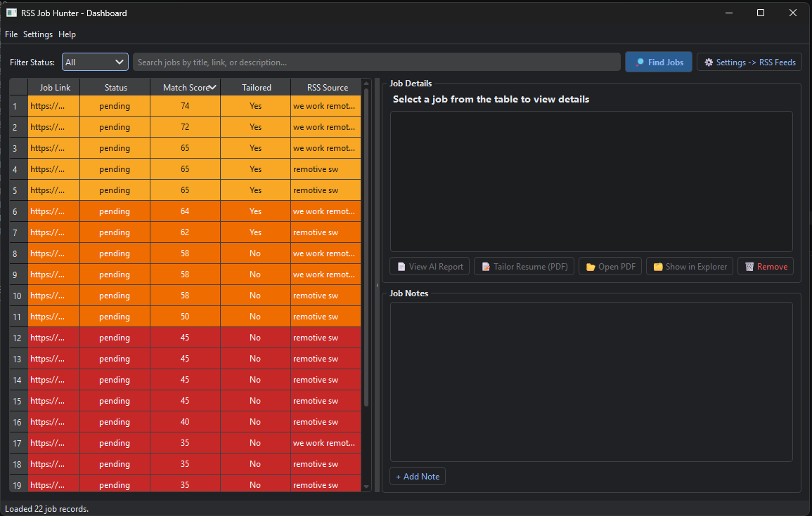
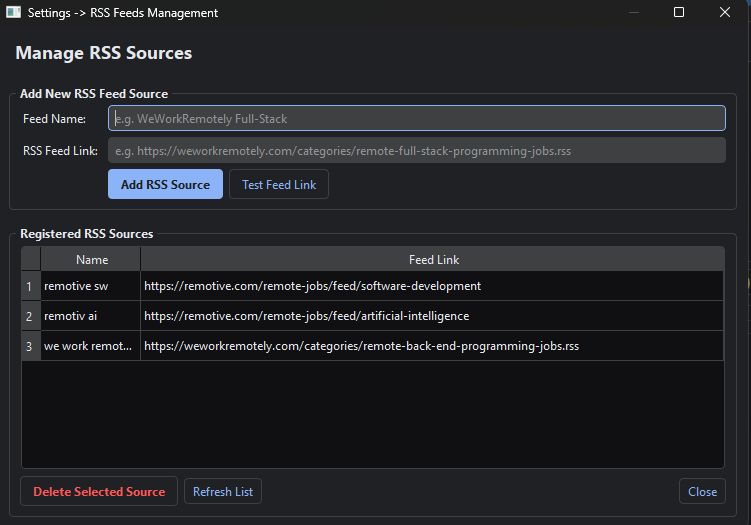
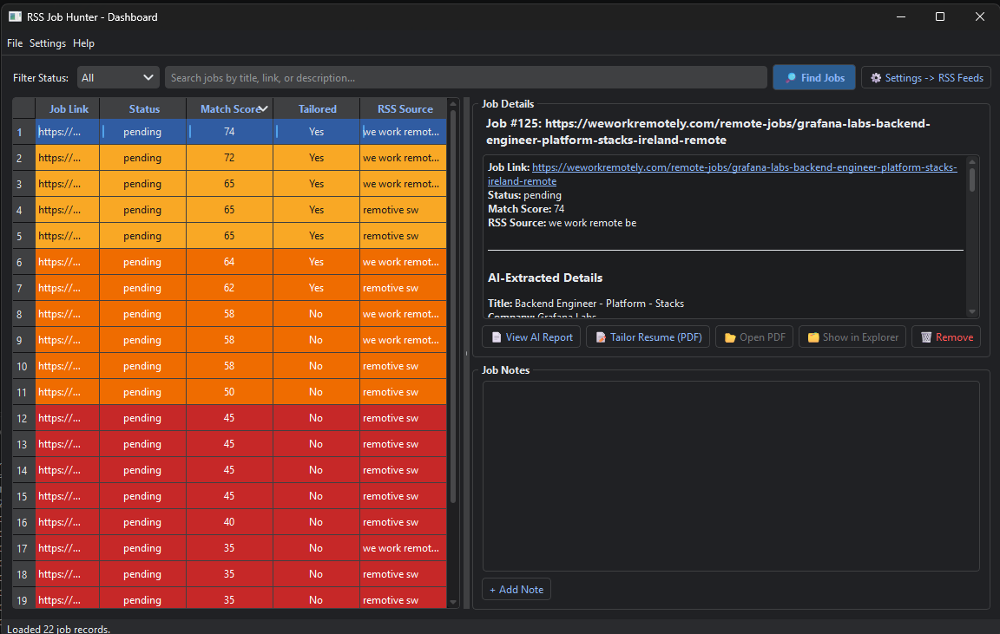
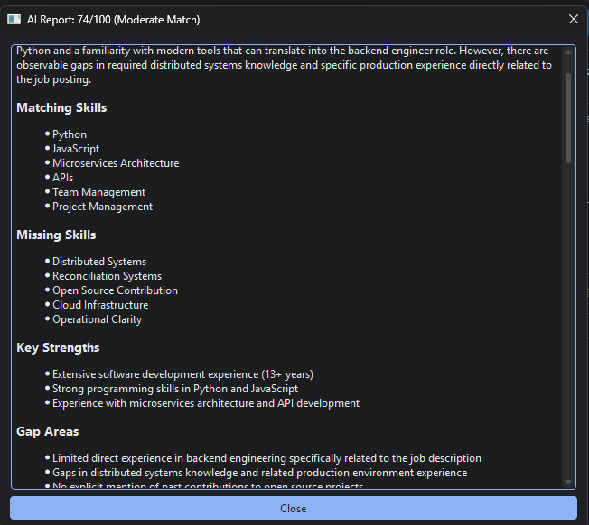

# RSS Job Hunter

A desktop tool that watches job-board RSS feeds, uses an LLM to extract and
score each new listing against your resume, and automatically generates a
tailored resume PDF for the ones worth applying to. Runs as a PyQt6 GUI
dashboard, or headless as a polling background service.

## What it does

1. **Fetch** — polls the RSS feeds you configure (job boards, company career
   pages, aggregators — anything with an RSS/Atom feed) and diffs against
   jobs already seen.
2. **Extract** — for each new item, an LLM agent (`RSSJobAgent`) pulls out a
   clean job description, canonical URL, and direct application link from the
   raw feed entry/HTML.
3. **Match** — your resume PDF is parsed once (`ResumeAgent`) and each new job
   is scored against it (`MatcherAgent`) on a 0-100 ATS-style fit score, with
   a written rationale ("AI Report").
4. **Tailor** — any job that clears `MATCH_SCORE_THRESHOLD` gets a tailored
   resume automatically generated (`TailorAgent`) and rendered to PDF.
5. **Notify** — optionally pushes a notification (Pushover and/or MQTT, e.g.
   to a LilyGO T-Display pager — see
   [`firmware/lilygo-tdisplay/README.md`](firmware/lilygo-tdisplay/README.md))
   when a strong match is found.

All of this is driven from one shared pipeline (`pipeline.py`) used by both
the GUI and the headless runner, so results are identical either way.

## Requirements

- Python 3.12+
- [uv](https://docs.astral.sh/uv/) (recommended) or pip
- An OpenAI API key
- Your resume as a PDF

## Setup

1. Install dependencies:

   ```bash
   uv sync
   ```

   or, with pip:

   ```bash
   pip install -e .
   ```

2. Copy the environment template and fill in your values:

   ```bash
   cp .env.example .env
   ```

   At minimum you need:
   - `OPENAI_API_KEY` — required for all LLM-backed features.
   - `RESUME_PATH` — path to your resume PDF (defaults to `resume.pdf` in the
     project root).

   Optional settings in `.env.example`:
   - `OPENAI_MODEL` / `OPENAI_BASE_URL` — swap models or point at an
     OpenAI-compatible proxy / local LLM (Ollama, vLLM, etc).
   - `MATCH_SCORE_THRESHOLD` — minimum ATS score (0-100) before a tailored
     resume is auto-generated. Defaults to 70.
   - `RUNNER_INTERVAL_MINUTES` — polling interval for headless mode. Defaults
     to 30.
   - `PUSHOVER_API_TOKEN` / `PUSHOVER_USER_KEY` — enables push notifications
     via [Pushover](https://pushover.net/) for new matches.
   - `MQTT_BROKER_HOST` / `MQTT_USERNAME` / `MQTT_PASSWORD` (+ optional
     `MQTT_BROKER_PORT`, `MQTT_TOPIC`, `MQTT_USE_TLS`) — enables MQTT
     notifications, e.g. to drive a small pager display. See
     [`firmware/lilygo-tdisplay/README.md`](firmware/lilygo-tdisplay/README.md)
     for a matching ESP32 build.

3. Place your resume PDF at the path you configured (default:
   `resume.pdf` in the project root).

## Usage

### GUI (default)

```bash
uv run main.py
```

or `python main.py` if you're not using uv.

This opens the dashboard window:



- **Settings → RSS Feeds** (or the toolbar button, `Ctrl+S`) — add, test, and
  remove RSS feed sources.

  

- **Find Jobs** (toolbar button, or File → Find Jobs, `Ctrl+R`) — runs one
  full fetch → extract → match → tailor pass across all configured feeds and
  populates the jobs table as results come in.
- **Jobs table** — every job found, color-coded by match score:
  - 🟢 80-100 — strong match
  - 🟡 65-79 — good match
  - 🟠 50-64 — moderate match
  - 🔴 0-49 — low match
  - Filter by status (pending / applied / interviewing / selected / rejected /
    withdrawn) or search by title, link, or description.
- Select a job to view its details, the AI Report (score + rationale), and
  (once tailored) open/export the tailored resume PDF, or add your own notes.
  Its status can also be changed from this panel — updates save to the
  database immediately and reflect back in the jobs table.

  

  Clicking **View AI Report** shows the full match breakdown: matching
  skills, missing skills, key strengths, and gap areas.

  

### Headless runner

```bash
uv run main.py --runner
```

Polls all configured feeds and runs the Find Jobs pipeline every
`RUNNER_INTERVAL_MINUTES`, with no GUI. Useful for running on a server or in
the background continuously. Logs to stdout and `logs/runner.log`. Stop with
Ctrl+C.

> Note: at least one RSS feed must be added via the GUI's Settings → RSS
> Feeds dialog before the runner has anything to poll — feed configuration is
> stored in the local SQLite database, which the GUI and runner share.

## Notifications

Pushover and MQTT notifications are both optional and independent — each
fires for any job scoring at or above `MATCH_SCORE_THRESHOLD`, provided its
required environment variables are set (unset/incomplete = silently
disabled, the pipeline itself isn't affected either way).

MQTT notifications publish a JSON payload (`title`, `message`, `url`,
`score`) to `MQTT_TOPIC`, intended for a small subscriber device to render.
A reference ESP32 (LilyGO T-Display) firmware implementation that renders
these as an animated notification card lives in
[`firmware/lilygo-tdisplay/`](firmware/lilygo-tdisplay/README.md).

## Data

Jobs, RSS sources, and notes are stored in a local SQLite database
(see `database/schema.sql`) — nothing is sent anywhere except the OpenAI API
(for extraction/matching/tailoring) and, if configured, your Pushover/MQTT
endpoints.
